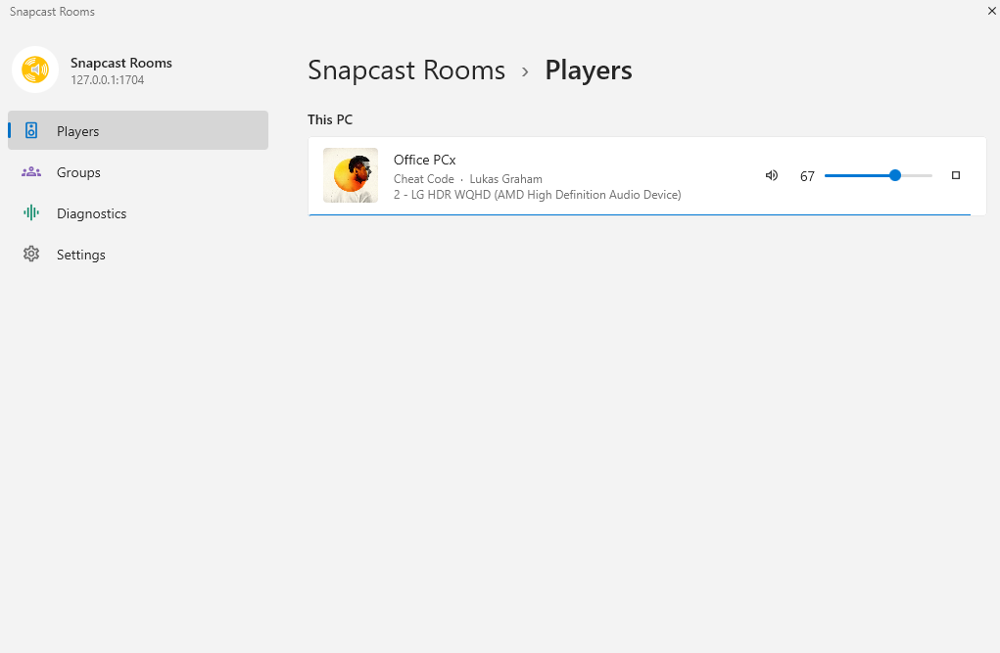
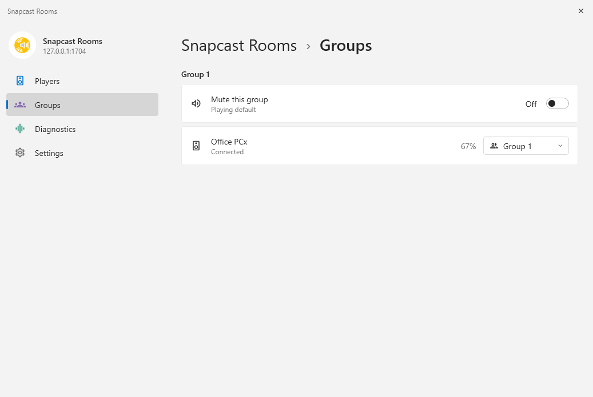
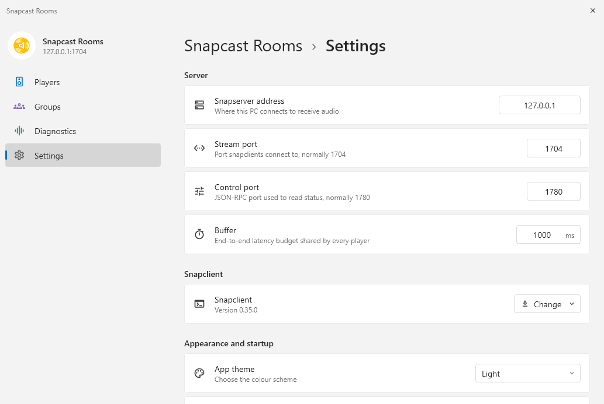
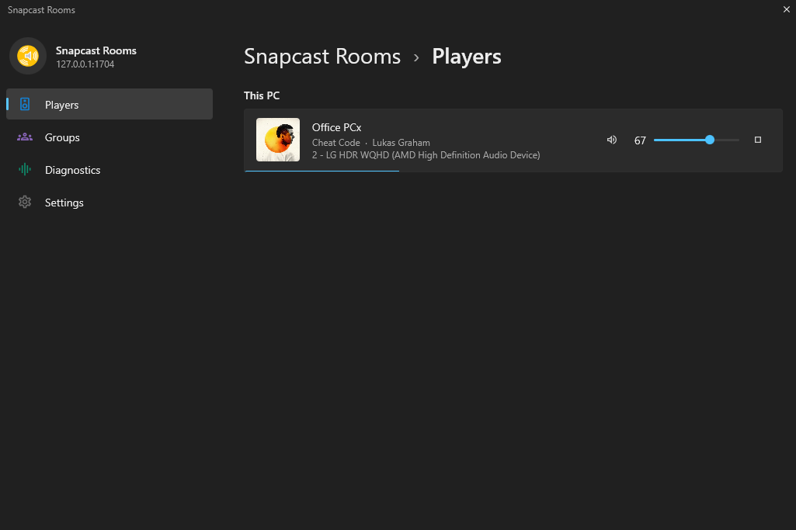

# Snapcast Rooms

A Windows desktop app for running and managing [Snapcast](https://github.com/badaix/snapcast)
clients on your PC. Start and stop players, choose which audio device each one
uses, set volume, and see what is playing.

This is an unofficial third-party client. It is not affiliated with the Snapcast
project.



Groups, and settings:





It follows the system theme:



## Why this exists

I set up multi-room audio at home with Snapcast and Music Assistant. The server
side went fine. The Windows client is what kept costing me evenings.

Getting `snapclient.exe` running the way I wanted meant finding the right
release, unpacking it somewhere sensible, then working out that the executable
will not start without the codec DLLs that ship next to it. Then that
`--soundcard` wants an endpoint GUID and not the device name you see in Windows.
Then that a second client on the same PC needs `--instance`, and that the
instance number becomes part of the client id the server sees. And at the end of
all that I still had a PowerShell window open for every player, and had to do it
again after each reboot.

So I wrote something that does all of it and remembers it.

This is a personal project. I built it for my own setup and put it here in case
it saves someone else the same evenings. There is no support, and it has only
ever run against one server.

AI was used to some degree in building it.

## What it does

- snapclient is downloaded from the official Snapcast releases, or copied from a
  build you already have. Either way the executable and the DLLs it needs end up
  in one working directory.
- Each player is one `snapclient` process bound to one Windows output, so a
  single PC can serve several rooms.
- Clients the server already reports on this machine are picked up at startup
  instead of being duplicated.
- Album art, title and artist come from the stream metadata, with a progress
  line along the bottom of each card.
- A client that exits is restarted with a backoff, and every player writes its
  own log.
- Closing the window leaves everything running in the tray.

## Requirements

Windows 10 or 11, and a reachable [Snapserver](https://github.com/badaix/snapcast).
Version 0.27 or newer if you want the track metadata.

Nothing else to install. `snapclient.exe` is downloaded by the app on first use.

## Install

Download the `.msi` from the [latest release](../../releases/latest) and run it.
It installs per-user, so there is no admin prompt.

There is a portable `.zip` next to it if you would rather not install anything.
Unpack it and run `Snapcast Rooms.exe`.

## First run

1. Open Settings and set the Snapserver address. The ports default to 1704 for
   audio and 1780 for control.
2. Under Snapclient, choose Download to fetch the client, or Browse to point at
   a build you already have.
3. Choose Add player, give it a name and pick an output device. The name is what
   the server and Music Assistant will show, so pick the one you want to keep.
4. Go to Players and press play.

Players already registered with the server for this machine are imported at
startup, so existing clients appear without being entered again.

## Building it yourself

You need JDK 21. The Gradle wrapper handles the rest.

```bash
git clone https://github.com/bnnsz/snapcast-rooms.git
cd snapcast-rooms

./gradlew run                          # run it directly
./gradlew packageReleaseMsi            # build the installer
./gradlew createReleaseDistributable   # build a portable folder
```

The installer lands in `build/compose/binaries/main-release/msi/` and the
portable build in `build/compose/binaries/main-release/app/`.

Building the MSI needs the [WiX Toolset](https://wixtoolset.org/) 3.x installed,
which is what jpackage shells out to. The portable build does not.

To stamp a version:

```bash
./gradlew packageReleaseMsi -PappVersion=1.2.3
```

## Where things are kept

| What | Where |
|---|---|
| Settings and players | `%APPDATA%\SnapcastRooms\snapcast-rooms.db` |
| snapclient and its DLLs | `%APPDATA%\SnapcastRooms\snapclient\` |
| Per-player logs | `%APPDATA%\SnapcastRooms\logs\<player>.log` |

If a player will not start, its log has the exact command line that was used and
everything snapclient printed.

## Known gaps

There is no latency trim. The control API call is there, nothing in the UI uses
it yet.

There is no single-instance lock, so two copies of the app will fight over the
same players.

The Diagnostics page is empty. It reads buffer and sync figures from snapclient
statistics lines that are not emitted at the log level the app runs it at.

Windows only. It uses WMI and WASAPI endpoint ids throughout.

## Licence

This app is MIT licensed. See [LICENSE](LICENSE).

Snapcast itself is GPL-3.0 and is not redistributed here. The app downloads
`snapclient.exe` from the official releases at runtime, or copies a build you
already have, so no Snapcast binary is part of this repository or its releases.
